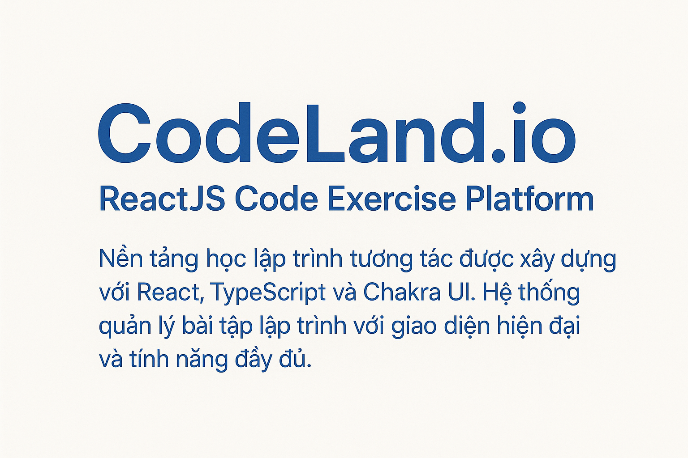
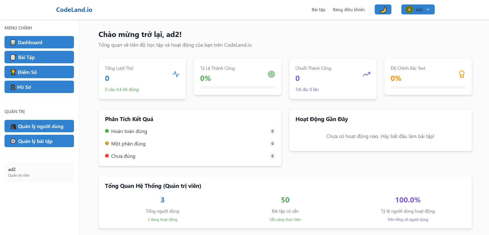

# 🎯 CodeLand.io - ReactJS Code Exercise Platform



# Nền tảng học lập trình tương tác được xây dựng với React, TypeScript và Chakra UI. Hệ thống quản lý bài tập lập trình với giao diện hiện đại và tính năng đầy đủ.



## 🚀 Công Nghệ Sử Dụng

- **React 19.1.0+** với TypeScript 5.8.3+
- **Vite 7.0.4+** cho development và build
- **Chakra UI v3** cho component system và theming
- **TanStack Query** cho server state management
- **TanStack Router** cho type-safe routing
- **Monaco Editor** cho code editor
- **ESLint** cho code quality

## 🎯 Tính Năng Chính

### 👥 Quản Lý Người Dùng (Admin)
- ✅ Danh sách người dùng với phân trang và tìm kiếm
- ✅ Thêm, sửa, xem chi tiết người dùng
- ✅ Phân quyền admin và user thường
- ✅ Thống kê hoạt động người dùng

### 📚 Quản Lý Bài Tập (Admin)
- ✅ Danh sách bài tập với lọc theo độ khó
- ✅ Tạo, chỉnh sửa bài tập với test cases động
- ✅ Xem chi tiết bài tập và solutions
- ✅ Thống kê bài tập theo độ khó

### 🔐 Xác Thực & Phân Quyền
- ✅ Đăng nhập/Đăng ký với JWT
- ✅ Route protection cho admin
- ✅ Persistent authentication state

### 🎨 Giao Diện & UX
- ✅ Dark/Light mode toggle
- ✅ Responsive design
- ✅ Loading states và error handling
- ✅ Toast notifications

## 📁 Cấu Trúc Dự Án

```
src/
├── components/          # UI Components tái sử dụng
│   ├── auth/           # Authentication components
│   ├── common/         # Generic components (LoadingSpinner, etc.)
│   ├── exercises/      # Exercise management components
│   ├── forms/          # Form components (Login, Register)
│   ├── layout/         # Layout components (Header, Footer)
│   └── users/          # User management components
├── pages/              # Page components
│   ├── auth/           # Login, Register pages
│   ├── exercises/      # Exercise management pages
│   ├── users/          # User management pages
│   └── dashboard/      # Dashboard pages
├── hooks/              # Custom React hooks
│   └── queries/        # TanStack Query hooks
├── services/           # API service functions
│   ├── api.ts          # Base API client
│   ├── auth.ts         # Authentication services
│   ├── users.ts        # User services
│   └── exercises.ts    # Exercise services
├── types/              # TypeScript definitions
├── utils/              # Utility functions
├── theme/              # Chakra UI theme configuration
└── App.tsx             # Root component
```

## 🛠️ Thiết Lập Môi Trường

### Yêu Cầu Hệ Thống
- **Node.js 20+** (khuyến nghị sử dụng phiên bản LTS)
- **npm 9+** hoặc **yarn 1.22+**
- **Git** cho version control

### 🔧 Cài Đặt Local Development

#### 1. Clone Repository
```bash
git clone https://github.com/longngo192/soa-final-project-frontend
cd soa-final-project-frontend
```

#### 2. Cài Đặt Dependencies
```bash
npm install
```

#### 3. Thiết Lập Environment Variables
```bash
# Sao chép file .env mẫu
cp .env.example .env

# Chỉnh sửa file .env với cấu hình của bạn
# Ví dụ:
VITE_API_URL=http://localhost:5001
VITE_APP_TITLE=CodeLand.io Dev
VITE_APP_ENV=development
```

#### 4. Chạy Development Server
```bash
npm run dev

# Ứng dụng sẽ chạy tại: http://localhost:5173
```

#### 5. Các Commands Hữu Ích

```bash
# Build cho production
npm run build

# Preview production build
npm run preview

# Lint code
npm run lint

# Run tests
npm run test

# Run tests trong watch mode
npm run test:watch
```

## 🐳 Chạy Bằng Docker

### 🏃‍♂️ Quick Start với Docker

#### 1. Clone và Setup
```bash
git clone https://github.com/longngo192/soa-final-project-frontend
cd codeland-frontend

# Copy environment template
cp .env.example .env
# Chỉnh sửa .env với cấu hình của bạn
```

#### 2. Frontend Only (Kết nối API ngoài)
```bash
# Chỉ chạy frontend, kết nối với API có sẵn
docker-compose -f docker-compose.frontend.yml up -d --build

# Truy cập: http://localhost:3000
```

## 🎨 Theme & Styling

### Dark/Light Mode
- Toggle tự động lưu preference
- System preference detection
- Smooth transitions

### Responsive Design
- Mobile-first approach
- Breakpoints: sm, md, lg, xl
- Flexible layouts với Chakra UI

## 📡 API Integration

### Backend API Endpoints
```typescript
// Authentication
POST /auth/login          # Đăng nhập
POST /auth/register       # Đăng ký
GET  /auth/status         # Kiểm tra auth status
GET  /auth/logout         # Đăng xuất

// Users Management (Admin only)
GET    /users/            # Lấy danh sách users
GET    /users/:id         # Lấy user theo ID
POST   /users/            # Tạo user mới
POST   /users/admin_create # Tạo user với quyền admin

// Exercises Management (Admin only)  
GET    /exercises/        # Lấy danh sách exercises
GET    /exercises/:id     # Lấy exercise theo ID
POST   /exercises/        # Tạo exercise mới
PUT    /exercises/:id     # Cập nhật exercise
POST   /exercises/validate_code # Validate code

// Scores
GET    /scores/           # Lấy danh sách scores
POST   /scores/           # Tạo score mới
GET    /scores/user       # Lấy scores của user hiện tại
```

### API Service Architecture
```typescript
// services/api.ts - Base API client
// services/auth.ts - Authentication services  
// services/users.ts - User management
// services/exercises.ts - Exercise management

// hooks/queries/ - TanStack Query hooks
// - useAuthQueries.ts
// - useUserQueries.ts  
// - useExerciseQueries.ts
```

**🎉 Happy Coding với CodeLand.io!**
